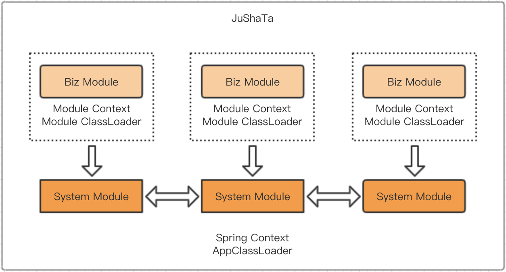

### JuShaTa容器

> JuShaTa是一个Java容器，提供模块隔离及模块热加载能力。

### 一、前言

大部分Java开发者，对Tomcat都不会太陌生，毕竟当时主流的开发方式还是将应用打包成war包，部署在webapps目录下随Tomcat运行。在Tomcat中，每个Web应用都有一个对应的类加载器实例，从而对每个应用的class和jar包进行隔离，避免应用之间类或者jar包冲突。

当然现在有了已经成为Java事实标准的Spring/SpringBoot框架后，可以直接在应用中集成内嵌的Tomcat或Jetty等Web容器，应用即可运行，这种开发方式带来的好处不言而喻交付即运维，这也更加符合devops理念。

但是在一个Java应用里面包含多个SpringBoot服务时，这些服务可能会调用不同版本的jar包，那么在程序启动或者运行过程中可能会报NoSuchMethodException这样的异常信息。特别是有的jar包版本不一样，在测试环境或者本地环境都没有问题，到了线上偶现由于加载不同版本jar包顺序不一样引起的异常，难以排查和重现。也有可能这些不同的服务里面有名字相同的bean，则会在启动时候报bean冲突。

基于此，我们提供了一个类似于Tomcat的Java容器JuShaTa，在JuShaTa容器中每个SpringBoot服务都是一个独立的模块。通过自定义ClassLoader，不同模块使用不同的ClassLoader进行加载，解决jar包冲突；使用Spring Context进行上下文隔离，每个模块对应一个Context，解决bean冲突。

### 二、背景

在日常开发环境中，经常会遇到团队协作，多人同时开发一个或多个大型项目。通常做法是将业务按照领域进行拆分成多个子项目或者微服务，拆分过程中不可避免的会出现以下的问题：

* 服务粒度拆分过粗，一些关联度较低的功能放在一个模块，不符合高内聚低耦合的设计原则。
* 服务粒度拆分过细，会出现大量模块，有些模块或微服务只包含少量功能，独立部署上线后访问量也会比较低，但也要占用一个java进程会比较浪费机器资源。因此会比较倾向于将这些模块进行独立开发，合并部署。至少在开发阶段，能够保证模块之间会比较独立解耦。但合并部署也会带来新的问题，模块独立运行时正常，合并一起就会启动不了，各种冲突接踵而至。

### 三、解决方案

基于以上问题，Jushata提供一种容器化的思路来解决，正于之前提到的Tomcat一样，将模块放到Jushata容器中，由容器来进行生命周期管理，容器提供模块隔离以及模块动态装载卸载的能力。

#### 1、开箱即用

* 基于SpringBoot开发，兼容原生SpringBoot-Starter模块，切换成本低。

#### 2、模块隔离

容器内部署多个模块时，将会带来以下问题：

* jar包冲突：如A模块依赖于fastjson-1.1.x，B模块依赖于fastjson-1.2.x，运行时很容易会报NoSuchMethodException。
* bean冲突：A模块和B模块都定义了xxxService，则会报bean冲突（当然可以通过设置allowBeanDefinitionOverriding属性解决，但会引来新的问题）。

因此，容器必须解决这两个问题：

* 解决jar包冲突，通过自定义ClassLoader来实现，不同模块使用不同的ClassLoader进行加载。
* 解决bean冲突，使用Spring Context进行隔离，每个模块对应一个Context，Context间可以有父子依赖关系。

#### 3、动态加载

* 容器提供热加载的能力，定时检查指定目录下的模块，或者通过容器暴露的API来进行模块管理。

### 四、整体架构：

Jushata容器整体架构如下，模块间通过ClassLoader及SpringContext进行隔离。

### 五、示例：

提供 jushata-samples 模块进行示例演示（测试前先运行mvn package生成模块打包）：

- jushata-sample-standard 演示对原生 springboot-starter 模块的兼容的能力
- jushata-sample-child1 和 jushata-sample-child2 演示fat-jar模块上下文隔离及类隔离的能力

更多开发文档见 [开发手册](./docs/demo.md)

